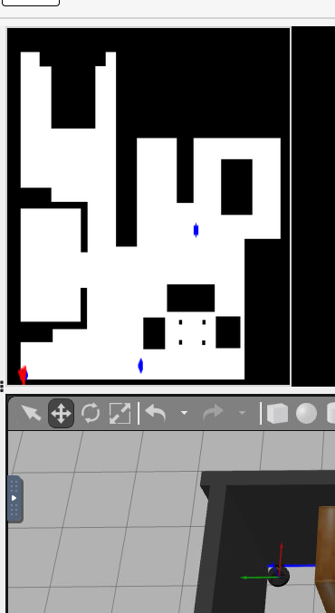
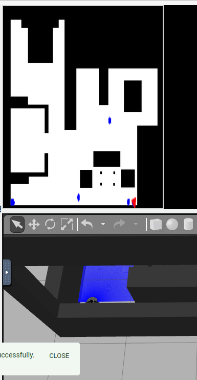
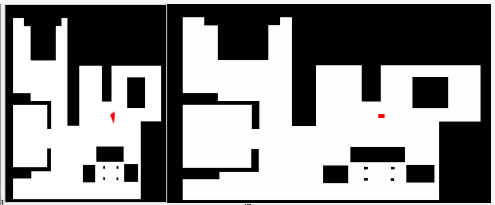
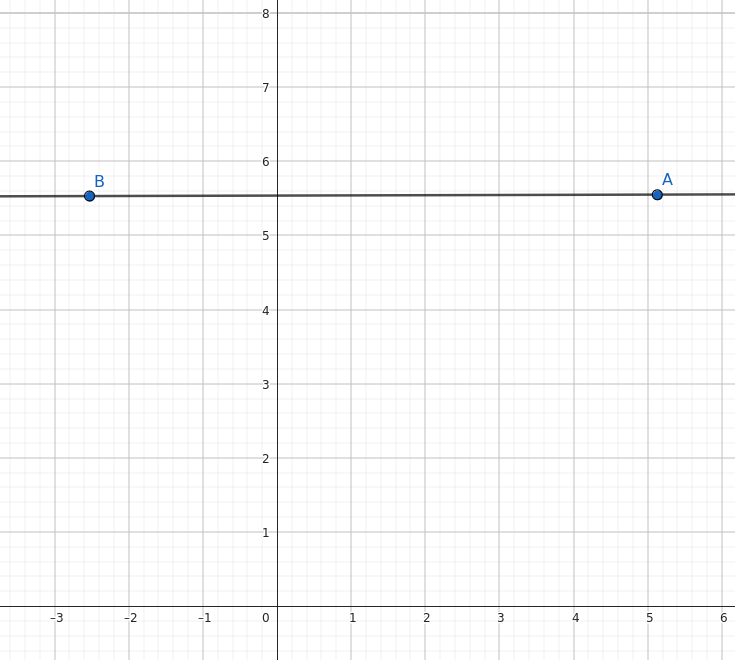

# Practice 1: High-End Vacuum Cleaner

The main goal of this practice is to clean a house by using a high-end vacuum cleaner. This implies completing 4 tasks:

1. Generate a translation between the robotic coordinates and the 
2. Build a grid to log which parts of the house have been cleaned.
3. Generate a navigation algorithm to move through grid cells (or map points)
4. Use BSA as a coverage algorithm for travelling all the house

# 1. Translating Robotic coordinates into Map coordinates.

By using the function `GUI.getMap()`, we obtain a **1025x1024** image of the house. We will use the position of the pixels as map coordinates. Since we want to travel and make later computations by only using map coordinates, we will try to transform every coordinate of the robot obtained with `HAL.getPose3d()` to map coordinates.

This conversion can be done with a transformation matrix similar to the following:

$$
\begin{bmatrix}
  x_{map} \\
  y_{map} \\
  z_{map} \\
  1
\end{bmatrix}
=
\begin{bmatrix}
  cos(\alpha) & -sin(\alpha) & 0 & tx \\
  sin(\alpha) & cos(\alpha) & 0 & ty \\
  0 & 0 & 1 & tz \\
  0 & 0 & 0 & 1
\end{bmatrix}
\bullet
\begin{bmatrix}
  x_{robot} \\
  y_{robot} \\
  z_{robot} \\
  1
\end{bmatrix}
$$

For solving this matrix, we must find the value of $tx$ (x-axis traslation), $ty$ (y-axis tralation), $tz$ (z-axias traslation), $\alpha$ (rotation), and $scale$. In order to approximate those values the following steps have been used:

### 1. Finding $tx$ and $ty$

First, we will find the conversion of three points by moving the robot and saving both the robot coordinates and map coordinates.


**Left-Bottom corner**:

<div align="center">
    
</div>

```json
Pose3D: {
  x: 5.1316
  y: 5.5555
  z: 0.0009
  ...
}
coordinates_in_map = [996, 48]
```

**Right-Bottom corner**:
<div align="center">
    
</div>

```json
Pose3D: {
  x: -2.527
  y: 5.5310
  z: 0.0009
  ...
}
coordinates_in_map = [996, 850]
```
**Center of the map**
<div align="center">
    
</div>

```json
Pose3D: {
  x: 0
  y: 0
  z: 0.0009
  ...
}
coordinates_in_map = [670, 570]
```

Now with those 3 points **we will use OpenCV** to automatically find a transformation matrix that moves those coords in the robot to coords in the map:

```python
points_A = np.array([[5.1316, 5.5555], [-2.527, 5.5310], [0, 0]], dtype=np.float32)
points_B = np.array([[996, 48], [996, 850], [670, 570]], dtype=np.float32)
M = cv2.getAffineTransform(points_A, points_B)
```

By using the $tx$ and $ty$ extracted from this approximation and moving those values a bit in order to minimice the error, we will determine the position freedom degree of the robot.

> Note that since $tz$ is constant for all the positions in the map, it can be ignored, (thus, we will use a 3x4 matrix from now on).

### 2. Finding $\alpha$
We can determine the angle between the horizontal by moving the robot in a horizontal line. Then with trigonometry we can extract the appropriate values, however in this case, since the result $\alpha$ is 180º, we can immediately discover the value by just looking how the coordinate points are reversed when graphicated:


<div align="center">
    
</div>

### 3. Finding the Scale
Since when moving horizontally, the points don't move in the y-axis but align in reversed positions (B -> A in the image from previous section), we can infer the distance in pixels by comparing it with the distance in the robot:

```python
  robot: 5.1316m - (-2.527m) = 7.6586m
  pixels: 850 - 48 = 802pixels

  scale = 802/7.6586 = 104.71
```

Finally we can use all the obtained values to traduce the coordinates.
> For simplifying the use of the map, a class `Map` has been designed with functionallities to translate (`robot2map()`) and to print some keypoints for debugging (`add_keypoint()`)

# 2. Building the Grid

**How it has been designed**

The `Grid` class has been designed to generate a grid over the map image obtained. Although the grid contains multiple functionalities for storing and extracting the cells easily, **the key strength resides on the `Cell` dataclass.**

This class will contain information not only about itself but about other adjacent cells. With this, we can obtain information about the environment just by looking to the current cell.


It will be responsibility of the grid to implement functions such as getting the current cell where the robot is located or extracting cells sequentially.

```python
@dataclass
class Cell:

    # Grid coordinates
    i: int
    j: int

    # Pixel coordinates
    x0: int
    y0: int
    center_x: Optional[int] = None
    center_y: Optional[int] = None
    content: Optional[np.ndarray] = field(default=None, repr=False)

    # Adjacent cells
    bottom: Optional["Cell"] = field(default=None, repr=False)
    top: Optional["Cell"] = field(default=None, repr=False)
    left: Optional["Cell"] = field(default=None, repr=False)
    right: Optional["Cell"] = field(default=None, repr=False)
    _from: Optional["Cell"] = field(default=None, repr=False)
```

**Some notes and improvements**

In order to determine the state of a cell, **its status will be defined by a color**. For example, if the cell is black or red, then the cell is occupied. If its white, then its clean, etc. Taking advantage of this property, we added the ("Explain here the Grid Wall Expansion")
